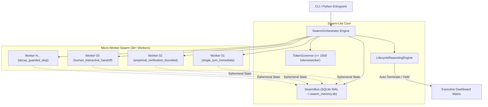

# Swarm-Lite 🐝

**Ultra-low-token 30+ agent swarm orchestration engine with dynamic adaptive lifecycle control.**

[](https://github.com/modus-znz/swarm-lite/actions/workflows/ci.yml)
[](https://opensource.org/licenses/MIT)
[](https://www.python.org/)
[](#architecture)
[](#design-decisions)

`swarm-lite` is a lightweight, zero-dependency, pure Python stdlib orchestration library engineered to fan out high-throughput subagent swarms.

---

## Table of Contents

- [Problem](#problem)
- [Architecture](#architecture)
- [Quickstart](#quickstart)
- [Usage](#usage)
- [Configuration](#configuration)
  - [Python API](#python-api)
  - [CLI Commands](#cli-commands)
  - [Adaptive Lifecycle Policies](#adaptive-lifecycle-policies)
- [Testing](#testing)
- [Operations](#operations)
- [Design Decisions](#design-decisions)
- [Limitations](#limitations)
- [Roadmap](#roadmap)
- [Contributing](#contributing)
- [License](#license)

---

## Problem

Traditional LLM agent orchestration frameworks accumulate full conversation history across multiple tool-use iterations. When fanning out multi-agent workloads across 30+ concurrent or sequential subagents, context overhead scales quadratically:

1. **Context Inflation & Budget Exhaustion**: Large agents consume tens of thousands of tokens per worker, burning token quotas rapidly.
2. **State Bloat & Stale Memory**: Monolithic agents retain unnecessary historical tool outputs, causing context dilution and hallucinated task boundaries.
3. **Static Termination Failure**: Naive binary turn limits either cut off long-running refactoring tasks prematurely or waste tokens on infinite retries when no diffs are being produced.

`swarm-lite` resolves these challenges by combining **zero-token ephemeral memory state buses (SQLite WAL)** with **dynamic adaptive worker lifecycle policies** and **hard token quota governors**.

---

## Architecture



---

## Quickstart

### Installation

`swarm-lite` requires **Python 3.9+** and uses **only standard library modules**.

```bash
pip install git+https://github.com/modus-znz/swarm-lite.git
```

Or clone and install locally in editable mode:

```bash
git clone https://github.com/modus-znz/swarm-lite.git
cd swarm-lite
pip install -e .
```

### 30-Second Example

```bash
# Fan out 30 micro-workers with single-turn immediate lifecycle termination:
swarm-lite run --workers 30 --policy single_turn_immediate --task "Parallel micro-audit"
```

---

## Usage

### Python API

```python
from swarm_lite import SwarmOrchestrator, LifecyclePolicy

# 1. Initialize orchestrator
orchestrator = SwarmOrchestrator()

# 2. Register a worker with an adaptive policy
worker = orchestrator.register_worker(
    worker_id="agent-linter-01",
    role="code_linter",
    task="Lint file module.py",
    policy=LifecyclePolicy.SINGLE_TURN_IMMEDIATE,
    max_tokens=1500,
)

# 3. Execute a worker step
result = orchestrator.step_worker("agent-linter-01")
print("Step Result:", result)

# 4. Fan out 35 micro-workers in batch
worker_specs = [
    {
        "worker_id": f"micro-worker-{i:02d}",
        "role": "executor",
        "task": f"Process partition #{i}",
        "policy": "empirical_verification_bounded",
        "max_tokens": 1500,
    }
    for i in range(1, 36)
]

summary = orchestrator.fan_out(worker_specs)
print("Total Executed Workers:", summary["total_workers"])

# 5. Render executive status matrix dashboard
print(orchestrator.render_matrix())
```

### CLI Commands

```bash
# Run a 30-worker swarm job
swarm-lite run --workers 30 --policy single_turn_immediate --task "Security static audit"

# View active swarm status JSON
swarm-lite status

# List registered micro-workers
swarm-lite list

# Render ASCII matrix dashboard
swarm-lite render
```

### Adaptive Lifecycle Policies

| Policy | Target Workload | Termination Criteria |
| :--- | :--- | :--- |
| `single_turn_immediate` | Formatting, linting, single file edits | Auto-terminates immediately post 1st turn output. |
| `empirical_verification_bounded` | Unit test repair, bug fixing | Runs until test verification passes (`verified=True`) or max turn bound (3 turns) is reached. |
| `human_interactive_handoff` | High-risk ops, architectural choices | Yields execution to interactive human review (`status='yielded_to_human'`). |
| `decay_guarded_stop` | Incremental refactoring, exploration | Auto-terminates if 2 consecutive turns produce no diffs or token budget cap is reached. |

---

## Configuration

Configure swarm parameters via environment variables or CLI flags:

| Variable | Description | Default |
|---|---|---|
| `SWARM_MEMORY_DB` | Path to SQLite WAL memory bus database | `~/.swarm_memory.db` |
| `SWARM_MAX_TOKENS_PER_WORKER` | Maximum micro-worker token budget limit | `1500` |

---

## Testing

Run the test suite using Python's built-in `unittest` runner:

```bash
python3 -m unittest discover -s tests
```

Tests cover:
- Zero-token memory bus (`SwarmBus`) persistence and WAL concurrency.
- Token quota governor (`TokenGovernor`) limits and over-budget rejection.
- All four worker lifecycle policies (`LifecycleReasoningEngine`).
- High-capacity 30+ worker fan-out orchestration.
- CLI subcommands and global flag parsing.

---

## Operations

### Memory Bus Inspection & Storage

State persistence uses SQLite in WAL (Write-Ahead Logging) mode, located at `~/.swarm_memory.db` by default. You can inspect active channel messages directly using Python or sqlite3:

```python
from swarm_lite import SwarmBus

bus = SwarmBus()
logs = bus.query(channel="lifecycle", limit=10)
for entry in logs:
    print(f"[{entry['created_at']}] Worker {entry['worker_id']}: {entry['value']}")
bus.close()
```

---

## Design Decisions

1. **Zero External Dependencies**: Implemented strictly with standard Python libraries (`sqlite3`, `argparse`, `json`, `time`, `pathlib`, `enum`, `typing`, `unittest`).
2. **Hard Token Ceiling (\(\le 1500\) tokens/worker)**: Micro-workers are designed for atomic subtasks rather than long-turn conversational loops.
3. **SQLite WAL Ephemeral State**: High-concurrency key-value store allows workers to publish key state changes without passing huge chat histories through prompt context.
4. **Adaptive Policy Auto-Termination**: Replaces arbitrary step counts with deterministic verification and decay boundaries.

---

## Limitations

- **Single-Host Thread/Process Scope**: Designed for in-process or local process orchestration; distributed multi-node network synchronization requires an external transport bridge.
- **Micro-Task Optimization**: Not intended for single large monolithic multi-hour agent conversations.

---

## Roadmap

- [ ] Multi-process IPC bridge for parallel worker worker-pools.
- [ ] Direct export of swarm telemetry to OpenTelemetry / Jaeger traces.
- [ ] Dynamic budget reallocation between parallel workers in real time.

---

## Contributing

Contributions are welcome! Please read [CONTRIBUTING.md](CONTRIBUTING.md) and [SECURITY.md](SECURITY.md) before submitting Pull Requests.

---

## License

[MIT License](LICENSE) © 2026 Modus ZNZ
